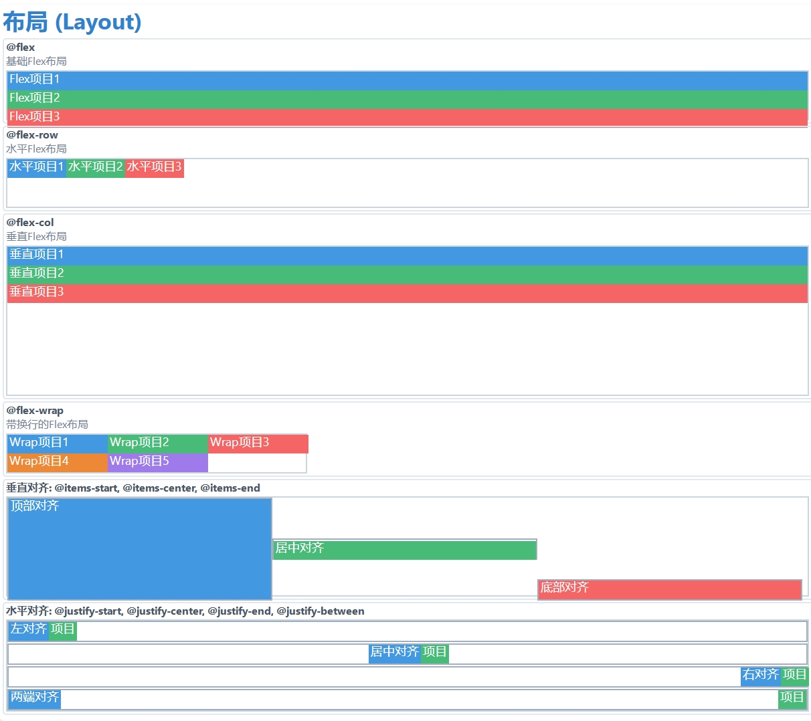

# Sciter Tailwind: 为Sciter.js设计的Tailwind风格工具类库

[](https://opensource.org/licenses/MIT)

一个轻量级的工具优先CSS库，灵感来自[Tailwind CSS](https://tailwindcss.com/)，专为[Sciter.js](https://sciter.com/)设计。它利用Sciter强大的`@mixin`功能，直接在CSS或内联样式中提供可复用的样式组件。

## 为什么选择Sciter Tailwind？

- **Tailwind哲学在Sciter中实现**：将Tailwind CSS的工具优先方法引入Sciter.js环境。直接在需要的地方应用样式，无需频繁切换到CSS文件。
- **利用Sciter的强大功能**：使用Sciter原生的`@mixin`功能实现高效可复用的样式。
- **轻量级且无依赖**：专为Sciter.js优化，无外部依赖。
- **直观熟悉**：提供类似Tailwind CSS的API，如果您熟悉Tailwind，可以轻松上手。
- **可定制**：通过调整变量和在`sciter-tailwind.css`中添加自己的mixin，轻松扩展或修改库。

## 安装

1. 下载`sciter-tailwind.css`文件。
2. 将其放入您的Sciter.js项目目录。
3. 在HTML文件的`<head>`部分链接它：

    ```html
    <head>
      <meta charset="utf-8">
      <title>我的Sciter应用</title>
      <!-- 链接CSS文件 -->
      <link rel="stylesheet" href="sciter-tailwind.css">
      <style>
        /* 可选：在此定义全局样式或组件样式 */
        body {
          @bg-color(@gray-100); /* 使用mixin应用背景 */
        }
      </style>
    </head>
    ```

## 使用

与传统Tailwind在HTML中使用工具类不同，Sciter Tailwind使用`@mixin`语法。您可以在`<style>`标签或HTML元素的`style`属性中应用这些mixin。

**1. 在CSS中(`<style>`标签或单独的`.css`文件)：**

```css
/* 为容器元素定义样式 */
.my-container {
  @flex-col;         /* 应用垂直flex布局 */
  @items-center;     /* 垂直居中项目 */
  @p(10px);          /* 所有边应用10px内边距 */
  @bg-color(@gray-100); /* 使用预定义变量设置背景颜色 */
  @rounded(5px);     /* 应用5px边框半径 */
}

/* 为按钮定义样式 */
.my-button {
  @btn(@blue-600, white); /* 使用预定义的按钮mixin */
  @mb(8px);               /* 应用8px下边距 */
  @shadow-md;             /* 应用中等的盒子阴影 */
}
```

**2. 在HTML中内联(`style`属性)：**

这通常是直接在元素上应用工具样式的首选方法，类似于Tailwind CSS的类方法。

```html
<body>
  <div style="@flex-col; @items-center; @p(16px); @bg-color(white); @rounded(8px); @shadow-lg;">
    <h1 style="@text-2xl; @font-bold; @text-color(@gray-800); @mb(10px);">欢迎！</h1>
    <p style="@text-color(@gray-600); @mb(15px);">这是使用内联Sciter Tailwind mixins的样式。</p>
    <button style="@btn(@green-500, white); @px(12px); @py(6px);">点击我</button>
  </div>

  <!-- 另一个例子 -->
  <div style="@flex-row; @justify-between; @items-center; @p(8px); @bg-color(@blue-100); @mt(20px);">
    <span>项目1</span>
    <span>项目2</span>
  </div>
</body>
```

## 可用的工具类Mixin

以下是提供的核心mixin列表。请参考`sciter-tailwind.css`获取确切的实现和可用变量(如颜色和尺寸)。

*(注意：`size`参数通常接受标准CSS单位如`px`、`em`、`%`等。`color`参数通常接受颜色名称、十六进制代码或预定义的颜色变量如`@blue-500`)*

### 布局
*   `@flex`: 基本flex显示。
*   `@flex-row`: 水平流(`flow: horizontal`)。
*   `@flex-col`: 垂直流(`flow: vertical`)。
*   `@flex-wrap`: 换行水平流(`flow: horizontal-wrap`)。
*   `@items-start`, `@items-center`, `@items-end`: 垂直对齐。
*   `@justify-start`, `@justify-center`, `@justify-end`, `@justify-between`: 水平对齐/分布。
*   `@grid`: 基本网格流(`flow: grid`)。
*   `@grid-template-columns(columns)`: 定义网格列(例如`1fr 1fr`)。
*   `@grid-gap(gap)`: 设置网格项之间的间距。

### 间距(边距和内边距)
*   `@m(size)`, `@mx(size)`, `@my(size)`, `@mt(size)`, `@mr(size)`, `@mb(size)`, `@ml(size)`: 边距工具。
*   `@p(size)`, `@px(size)`, `@py(size)`, `@pt(size)`, `@pr(size)`, `@pb(size)`, `@pl(size)`: 内边距工具。

### 尺寸
*   `@w(size)`, `@h(size)`: 宽度和高度。
*   `@min-w(size)`, `@min-h(size)`: 最小宽度/高度。
*   `@max-w(size)`, `@max-h(size)`: 最大宽度/高度。
*   `@w-full`, `@h-full`: 100%宽度/高度。

### 排版
*   `@text(size)`: 字体大小(例如`@text(1.2em)`)。
*   `@text-sm`, `@text-base`, `@text-lg`, `@text-xl`, `@text-2xl`, `@text-3xl`, `@text-4xl`: 基于变量的预定义字体大小。
*   `@font-bold`, `@font-normal`: 字体粗细。
*   `@text-left`, `@text-center`, `@text-right`: 文本对齐。
*   `@text-color(color)`: 文本颜色。
*   `@truncate`: 防止文本换行并添加省略号(`overflow-x: hidden; text-overflow: ellipsis; white-space: nowrap;`)。

### 背景和边框
*   `@bg-color(color)`: 背景颜色。
*   `@rounded(size)`: 边框半径。
*   `@rounded-full`: 完全圆角(`border-radius: 9999px`)。
*   `@border(width, color)`: 设置边框(例如`@border(1px, @gray-300)`)。

### 效果
*   `@shadow-sm`, `@shadow`, `@shadow-md`, `@shadow-lg`: 不同大小的盒子阴影。

### 组件(预定义样式)
*   `@btn(bg-color, text-color)`: 基本按钮样式。
*   `@card`: (当前提供的CSS中未定义，但在旧README中列出-考虑添加或删除)。

## 示例

查看`sciter-tailwind-demo.htm`文件，了解各种mixin的综合演示。

## 自定义

随意修改`sciter-tailwind.css`：

-   **颜色**：调整`@const`颜色变量(例如`@blue-500`)以匹配您的品牌调色板。
-   **间距/尺寸**：如果需要，修改默认间距或尺寸值。
-   **Mixin**：为您的特定UI模式添加新的mixin或扩展现有的mixin。

## 重要说明

-   这个库**专为Sciter.js设计**，由于依赖Sciter特定的CSS功能(`@mixin`、`flow`等)，在标准Web浏览器中无法工作。
-   样式通过`@mixin`调用应用，而不是HTML类。
-   参数化mixin(例如`@p(size)`)提供了灵活性。

## 示例截图




## 贡献

欢迎贡献、问题和功能请求！

## 许可证

[MIT](https://opensource.org/licenses/MIT)